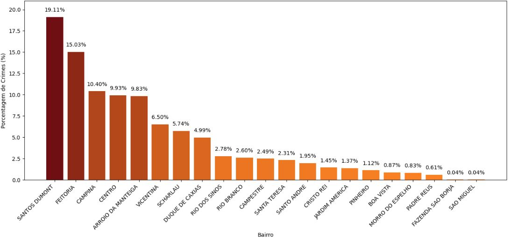
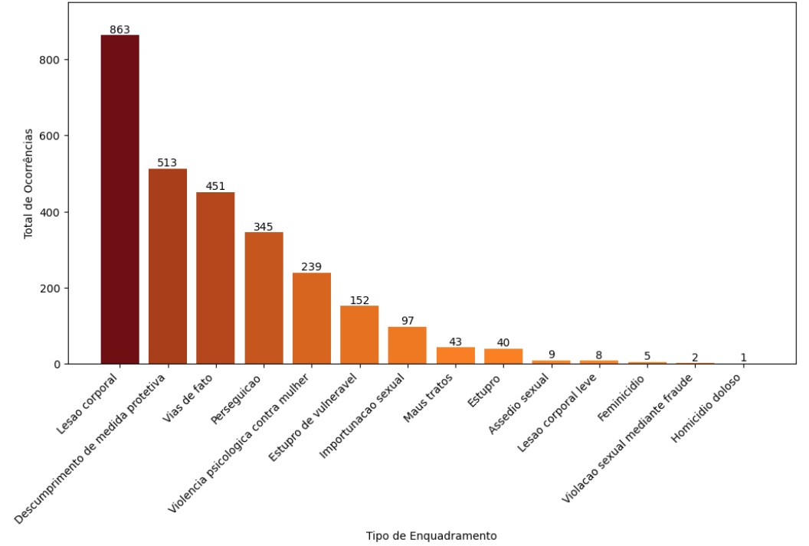
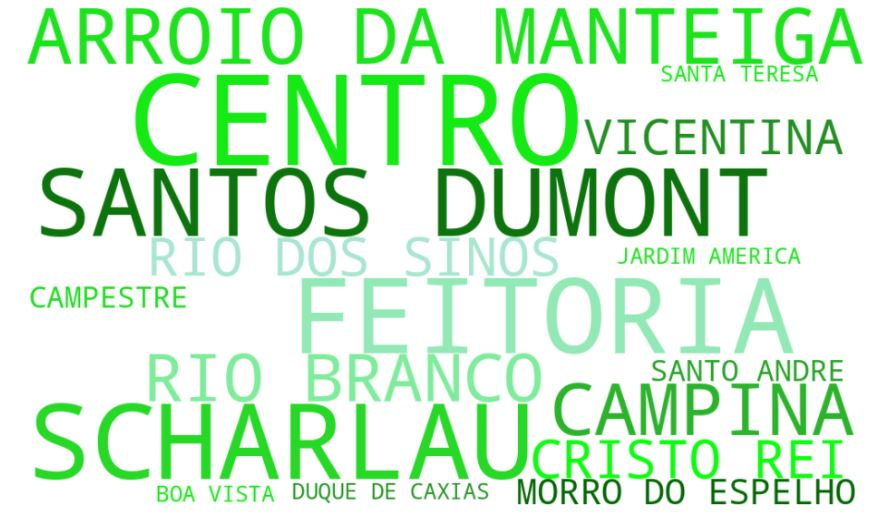

### Registros de ocorrências criminais contra a mulher na cidade de São Leopoldo no Estado do Rio Grande do Sul/Brasil 

#### Objetivo do projeto

Esse projeto tem como objetivo analisar os dados de crimes praticados contra a mulher e classificar quais bairros da cidade são menos seguros para esse público.  

#### Fonte de dados

Como fonte de dados, foram utilizadas bases de dados públicas de 2021 a outubro de 2024, disponibilizadas pela Secretaria da Segurança Pública do Estado do Rio Grande do Sul.

:file_folder: Link para acesso a base de dados [aqui](https://ssp.rs.gov.br/dados-abertos)
 
 

#### Tecnologias e ferramentas

:computer: Edição e Limpeza dos dados: Foi realizada uma primeira etapa de edição e limpeza de dados através da linguagem de programação <strong>Python</strong> utilizando o <strong>Google Colab</strong>.

:books: Bibliotecas utilizadas:
<li> pandas: para manipulação e análise de dados. </li>
<li> numpy: para operações numéricas e manipulação de arrays. </li>
<li> matplotlib e seaborn: criação de gráficos e visualizações de dados. </li>

<li> folium: criação de mapas interativos em Python. </li>
<li> geopandas: manipulação e análise de dados geoespaciais. </li>
<li> folium.Choropleth: classe do Folium para criar mapas coropléticos. </li>

<li> wordcloud: criação de nuvem de palavras. </li>

<li> Scikit-Learn e TensorFlow: aplicação do modelo de deep learning. </li>
<li> Scikit-Learn (KMeans): clusterização. </li>

#### Alguns resultados

:earth_americas: Mapa de São Leopoldo

  

  

:chart_with_downwards_trend: Porcentagem de ocorrências por bairro

  

  

:chart_with_downwards_trend: Total de ocorrências por tipo

  

  

:chart_with_downwards_trend: Nuvem de palavras dos bairros com maior incidência de casos de Importunação e Assédio

  

  

:chart_with_downwards_trend: Após aplicação do modelo de deep learning - Bairros classificados como Muito Inseguros

  

:chart_with_downwards_trend: Após a clusterização - Distribuição dos dados de Idade e Clusterização nos casos de ocorrências de Lesão Corporal 

 

  

